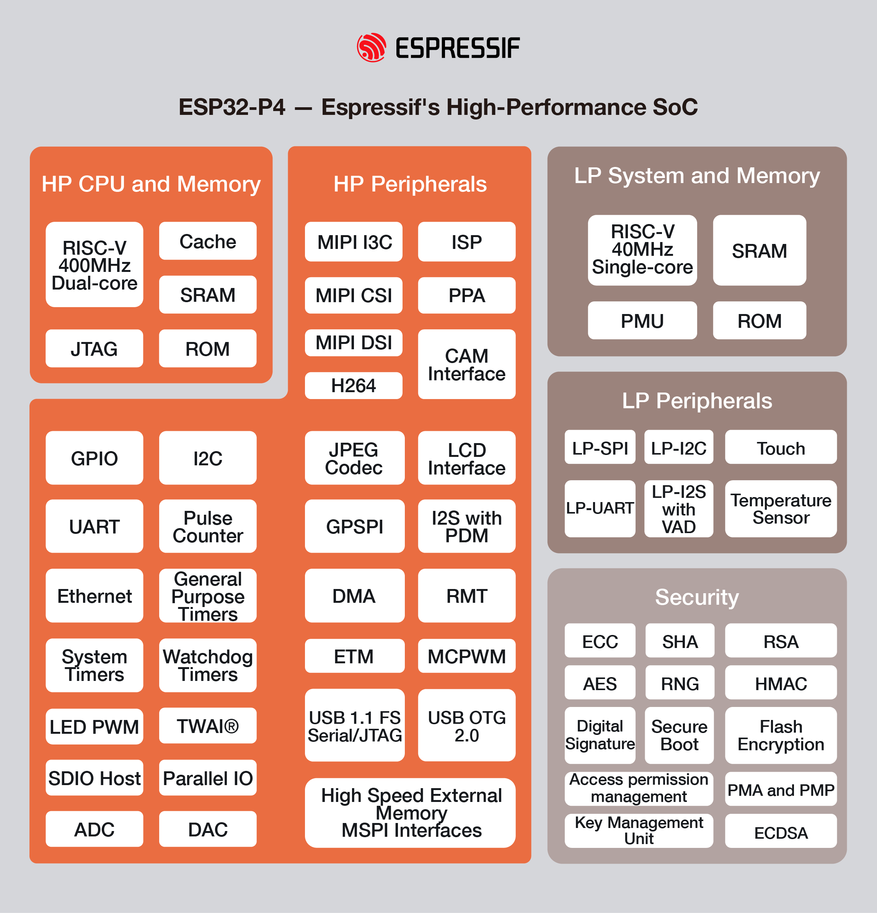

# [ESP32-P4](https://doc.soc.xin/ESP32-P4)

* [Espressif](https://www.espressif.com/): [RISC-V](https://github.com/SoCXin/RISC-V)
* [L3R3](https://github.com/SoCXin/Level): 2x 400 MHz 

### [简介](https://www.espressif.com/en/news/ESP32-P4)

[ESP32-P4](https://github.com/SoCXin/ESP32P4) 

#### 关键参数

* 400 MHz RISC-V Dual Core

Open Source SDK [ESP-IDF](https://github.com/espressif/esp-idf)

### [资源收录](https://github.com/SoCXin)

* [参考资源](src/)
* [参考文档](docs/)
* [参考工程](project/)

### [选型建议](https://github.com/SoCXin/ESP32P4)

[ESP32-P4](https://github.com/SoCXin/ESP32P4) 

### [www.SoC.xin](http://www.SoC.Xin)
